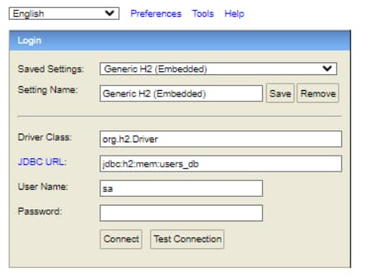
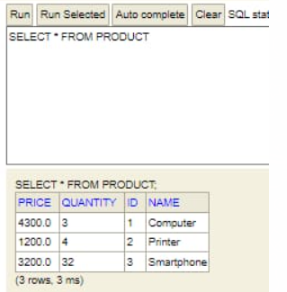
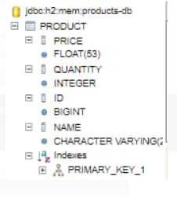
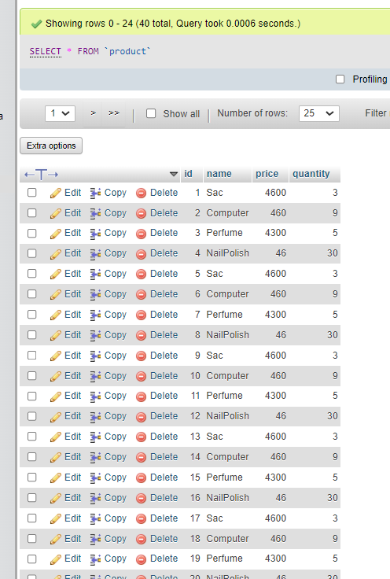
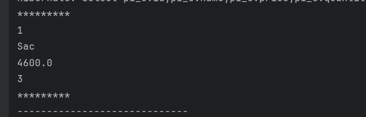
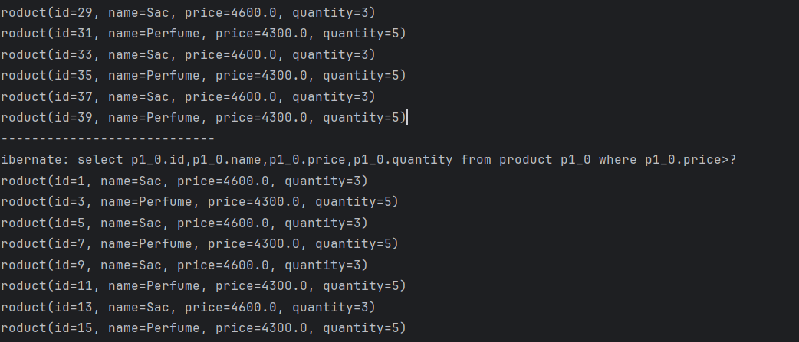
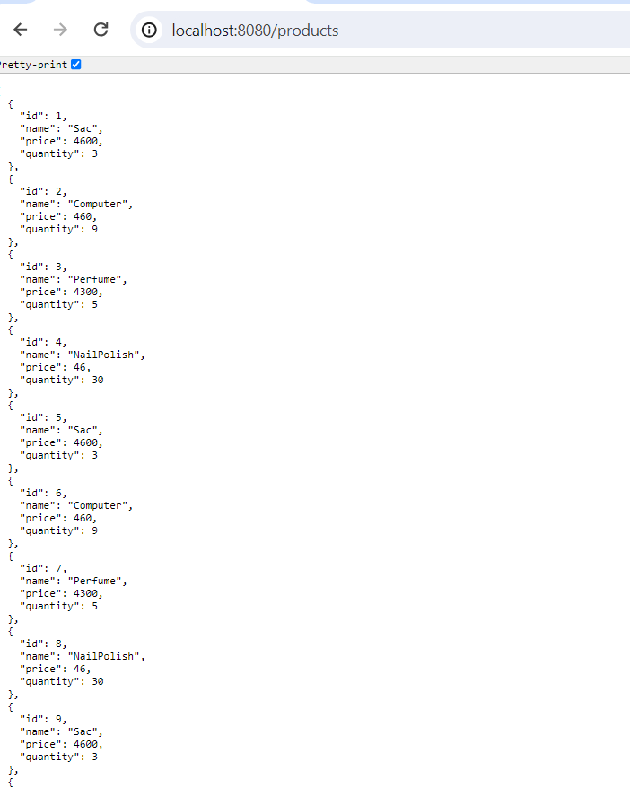
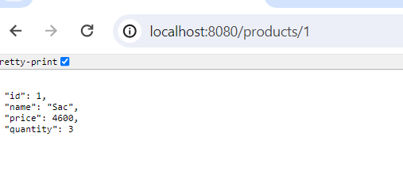

<h1>Tp2 Partie1</h1>

Conexion H2

Les donnes de la classe products

Les attributs de la classe

Base de donnees mysql

Chercher par id 

La difference entre la methode jpa et Query hql

Affichage du produit dans le web services format json

Affichage par id dans web service

